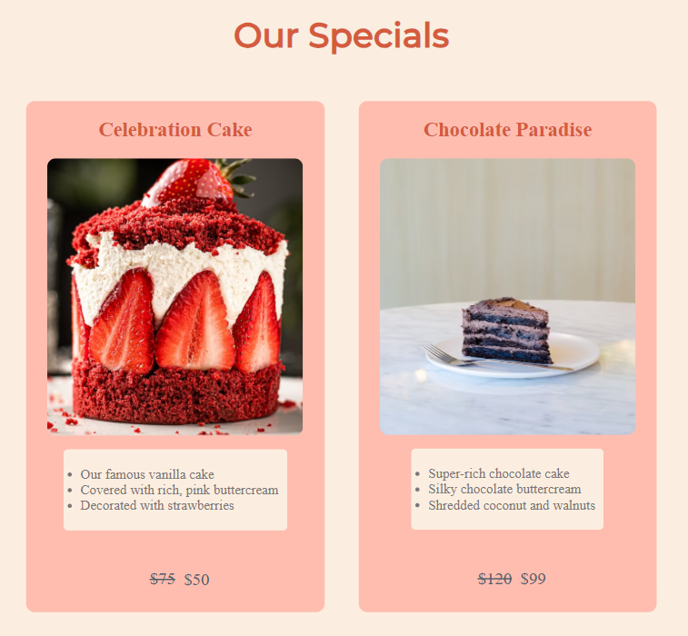

<h1 align="center"> <b>Backery Project</b></h1>

<h2 align="center">Hello! I'm Anastasiia Kucher 
</h2>

<h3 align="center">FullStack Developer and Project Manager from Ukraine!</h3>
<br> 
<h3 align="center">This project was built with the usage of HTML/CSS in order to place the assortment of products, prices and some details about the bakery. So it is easy for all the people who doesn't have an opportunity to go to the bakery- to look through all the aviable cakes online. It is user-friendly page where everyone can easy to look through all the assistance, prices and get to know the bakery's workers.</h3>  
<div align="center">


</div>

<p> <b> Easy steps to run the project:</b> </p> 

1. Wride down into the terminal this combination:

 git clone https://github.com/AnastassiiaKucher/ak-bakery.git

2. Open new terminal
3. code .
4. nmp start

<p> <b> Usage & Code listing: </b></p>

1. The header of the web-site, presenting the introduction to the assortment of the bakery.


```
    <!--H1-->

    <div class="header">
        <h1 class="heading">Peach Bakery</h1>
    </div>

    <div class="images-section">
    
    
    </div>

    <div class="header">
        <h2 class="heading-h2"> We bake with passion</h2>
    </div>
```

2. The section where you can see more the beauty and cozy atmosphere of the bakery.


```
     <div class="header">
        <h2 class="heading-h2"> Come and experience the difference</h2>
    </div>

    <div class="header">
        
        
        </div>
```

3. The section where everyone can look through the aviable cakes, prices, description to them, discounts or great price deals.


```
     <div class="header">
    <h2 class="heading-h2" >Our Specials</h2>
    </div>

    <!--First two items-->

    <div class="wrapper">

    <div class="item">
        <h2 class="item-name">Celebration Cake</h2>
        
        <ul class="space">
            <li>Our famous vanilla cake</li>
            <li>Covered with rich, pink buttercream</li>
            <li>Decorated with strawberries</li>
        </ul>
        <p><del>$75</del><ins>$50</ins></p>
    </div>
```
 
4. The section where everyone can get known about everyone of the bakery's team.
    
```
 <!--Footer-->

            <div class="header">
                
            </div>
```
